# IDM Demo

## Windows Configurations

### Enable Excution Policy

```powershell
Set-ExecutionPolicy Unrestricted
```

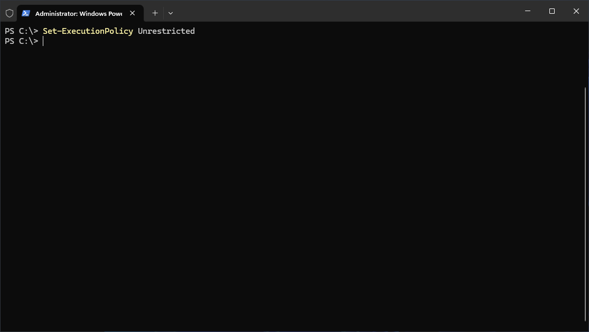

### Enable Custom Domains

```powershell
.\scripts\1-domain-setup.ps1
```

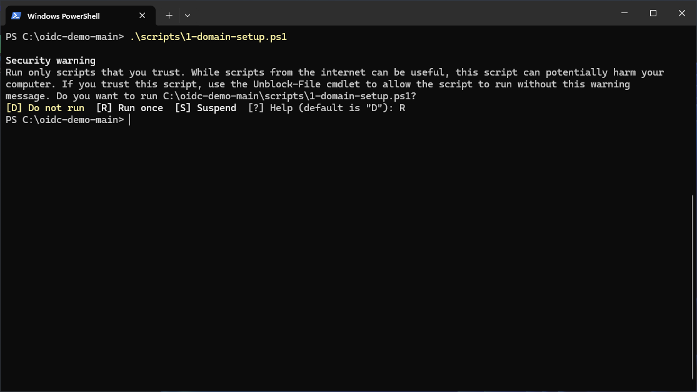

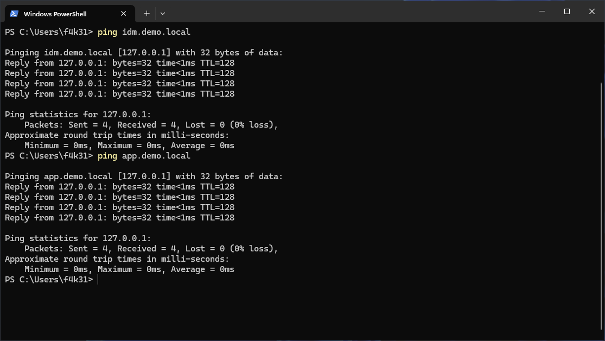

### Enable WSL 2

```powershell
.\scripts\2-wsl-enable.ps1
```

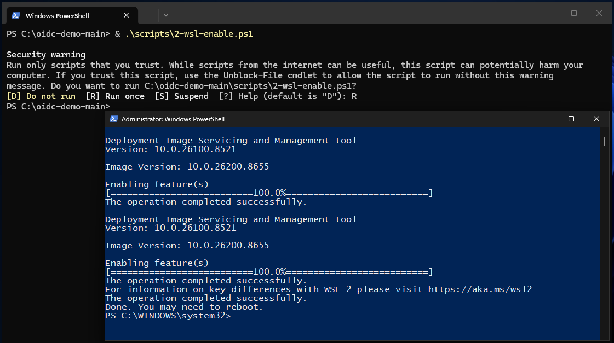

### Update WSL 2 Engine

```powershell
wsl --update
```

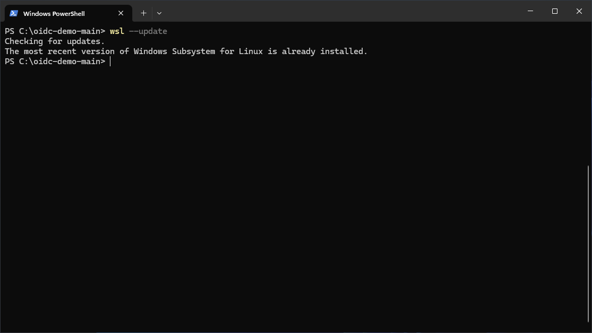

### Install Debian on WSL 2

```powershell
.\scripts\3-wsl-debian-install.ps1
```

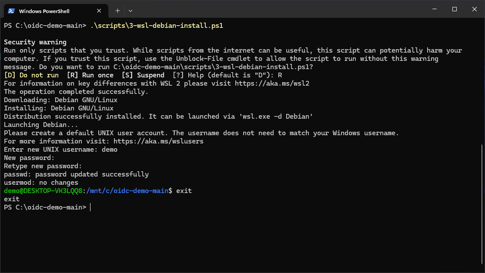

### Install Docker

```powershell
.\scripts\4-wsl-docker-setup.ps1
```

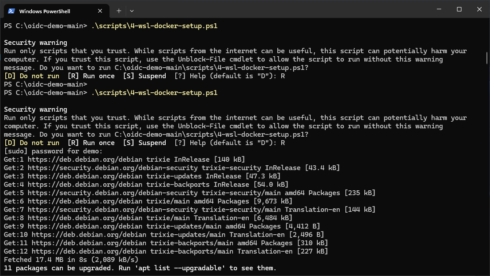

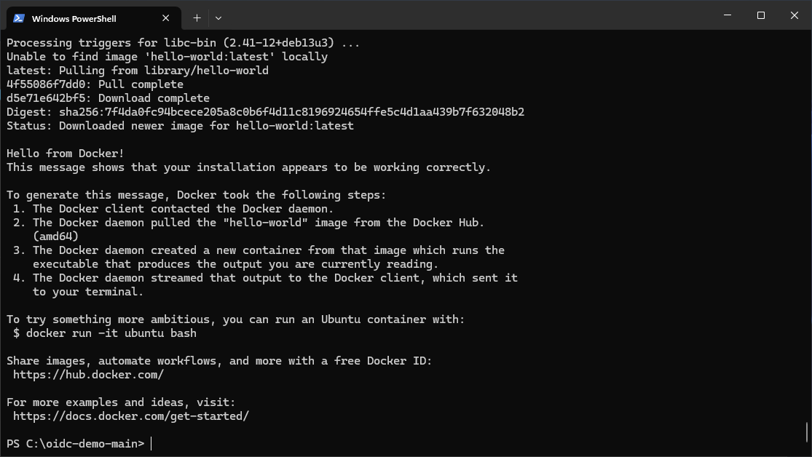

### Start Services

```
wsl

docker compose up -d
```

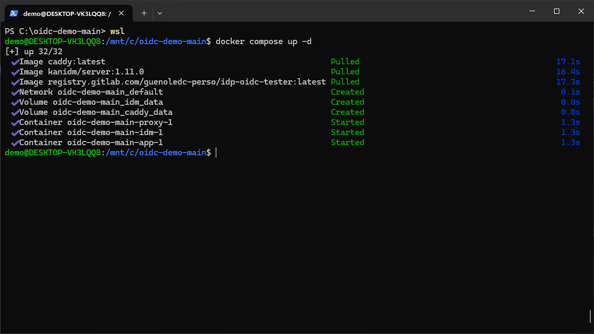

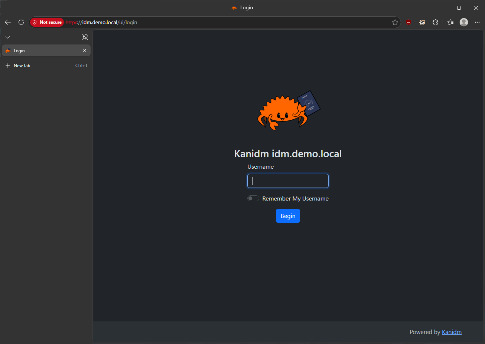

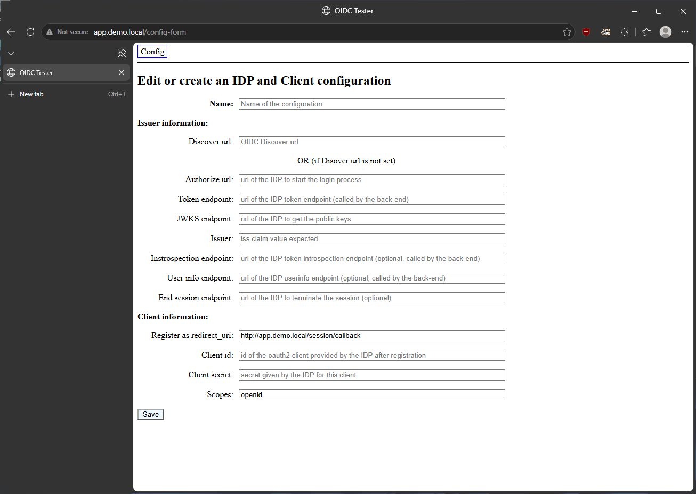

## IDM Commands

### Recover Account Password

#### Recover System Administrator Password

```sh
docker compose run idm recover-account admin
```

#### Recover IDM Administrator Password

```sh
docker compose run idm recover-account idm_admin
```

### IDM Client User Login

#### System Administrator Login

```sh
docker compose run --rm idm-tools login -D admin
```

#### IDM Administrator Login

```sh
docker compose run --rm idm-tools login -D idm_admin
```

#### View Login Sessions

```sh
docker compose run --rm idm-tools session list
```

### Customize IDM

#### Update Site Image

```sh
docker compose run --rm idm-tools system domain set-image /root/Shared/domain-image.png png -D admin
```

#### Update IDM Site Display Name

```sh
docker compose run --rm idm-tools system domain set-displayname 'Demo IDM' -D admin
```

### Setup IDM Users

#### Create New Users

```sh
docker compose run --rm idm-tools person create "demo-user-1" "Demo User 1" -D idm_admin
docker compose run --rm idm-tools person update --mail "demo-user-1@app.demo.local" "demo-user-1" -D idm_admin

docker compose run --rm idm-tools person create "demo-user-2" "Demo User 2" -D idm_admin
docker compose run --rm idm-tools person update --mail "demo-user-2@app.demo.local" "demo-user-2" -D idm_admin
```

#### Create User Credential Reset Tokens

```sh
docker compose run --rm idm-tools person credential create-reset-token "demo-user-1" -D idm_admin
docker compose run --rm idm-tools person credential create-reset-token "demo-user-2" -D idm_admin
```

#### View Registered Users

```sh
docker compose run --rm idm-tools person list -D idm_admin
```

#### Recover Create User Passwords

```sh
docker compose run idm recover-account 'demo-user-1'
docker compose run idm recover-account 'demo-user-2'
```

Test user login on <https://idm.demo.local>

### Setup OAuth2 Client

#### Create New OAuth2 Client

```sh
docker compose run --rm idm-tools system oauth2 create demo-app 'Demo App' 'http://app.demo.local' -D idm_admin
```

#### Configure OAuth2 Client

```sh
docker compose run --rm idm-tools system oauth2 warning-insecure-client-disable-pkce demo-app -D idm_admin
docker compose run --rm idm-tools system oauth2 warning-enable-legacy-crypto demo-app -D idm_admin
docker compose run --rm idm-tools system oauth2 add-redirect-url demo-app 'http://app.demo.local/session/callback' -D idm_admin
docker compose run --rm idm-tools system oauth2 show-basic-secret demo-app -D idm_admin
```

#### Customize OAuth2 Client Image

```sh
docker compose run --remove-orphans --rm idm-tools system oauth2 set-image demo-app /root/Shared/app-image.png png -D idm_admin
```

#### Create Access Group

```sh
docker compose run --rm idm-tools group create demo-access -D idm_admin
```

#### Configure Access Group Scopes

```sh
docker compose run --rm idm-tools system oauth2 update-scope-map demo-app demo-access openid email profile groups -D idm_admin
```

#### Add User To The Access Group

```sh
docker compose run --rm idm-tools group add-members demo-access "demo-user-1" -D idm_admin
docker compose run --rm idm-tools group add-members demo-access "demo-user-2" -D idm_admin
```

#### Show Availabel OAuth2 Clients

```sh
docker compose run --rm idm-tools system oauth2 list -D idm_admin
```

#### Show OAuth2 Client Secrets

```sh
docker compose run --rm idm-tools system oauth2 show-basic-secret demo-app -D idm_admin
```

#### Discovery URL

```
https://idm.demo.local/oauth2/openid/demo-app/.well-known/openid-configuration
```
